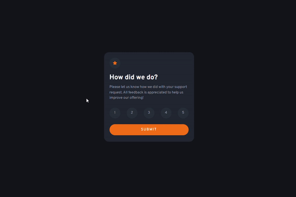

# Frontend Mentor - Interactive rating component solution

This is a solution to the [Interactive rating component challenge on Frontend Mentor](https://www.frontendmentor.io/challenges/interactive-rating-component-koxpeBUmI).

## Table of contents

- [Overview](#overview)
  - [The challenge](#the-challenge)
  - [Screenshot](#screenshot)
  - [Links](#links)
- [My process](#my-process)
  - [Built with](#built-with)
  - [What I learned](#what-i-learned)
  - [Useful resources](#useful-resources)
- [Author](#author)

## Overview

In this challenge, we have to build a rating component that have two states. One for rating and another is for thank you state after rating.

### The challenge

Users should be able to:

- View the optimal layout for the app depending on their device's screen size
- See hover states for all interactive elements on the page
- Select and submit a number rating
- See the "Thank you" card state after submitting a rating

### Screenshot

### Links

- [Solution URL](https://github.com/anhhuynh1506/Interactive-Rating-Component-Main.git)
- [Live site URL](https://anhhuynh1506.github.io/Interactive-Rating-Component-Main/)

## My process

### Built with

- Semantic HTML5 markup
- Bootstrap
- CSS
- Mobile-first workflow
- Javascript (for update the state)

### What I learned

This is my first time using Javascript in these challenges. Some basic methods I have used: querySelector(), querySelectorAll(), style.display, addEventsListener(). 

### Useful resources

- [w3schools](https://www.w3schools.com/css/)
- [MDN](https://developer.mozilla.org/) 

These two webside are to learn every basic knowledge to build this card challenge.

- [The Web Developer Bootcamp 2022 Course](https://www.udemy.com/course/the-web-developer-bootcamp/) in Udemy. I'm halfway done.

## Author

- Github - [Nguyễn Huỳnh Anh](https://github.com/anhhuynh1506)
- Frontend Mentor - [@anhhuynh1506](https://www.frontendmentor.io/profile/anhhuynh1506)
